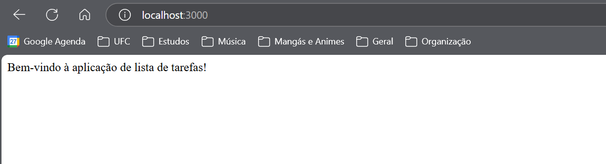

# Todo App

Esta é uma aplicação simples de lista de tarefas construída com Node.js e Docker.

## Pré-requisitos

- Docker
- Docker Compose

## Como Executar o Projeto

1. Clone o repositório:
    ```sh
    git clone https://github.com/seu-usuario/todo-app.git
    cd todo-app
    ```

2. Construa e inicie os contêineres Docker:
    ```sh
    docker-compose up -d
    ```

3. Acesse a aplicação em [http://localhost:3000](http://localhost:3000).

## Endpoints da API

- **Obter todas as tarefas**: `GET /tarefas`
- **Obter uma tarefa específica**: `GET /tarefas/:id`
- **Adicionar uma nova tarefa**: `POST /tarefas`
  ```json
  {
    "tarefa": "Minha nova tarefa"
  }
- **Atualizar uma tarefa existente**: `PUT /tarefas/:id`
  ```json
  {
    "tarefa": "Minha tarefa atualizada"
  }
- **Remover todas as tarefas**: `DELETE /tarefas`
- **Remover uma tarefa específica**: `DELETE /tarefas/:id`

## Prints das Principais Etapas
Os prints das principais etapas do processo estão na pasta [prints](prints).

1. **Criação da imagem**
    
2. **Execução do container**
    

3. **Sistema executando**
    

4. **Dados sendo persistidos**
    